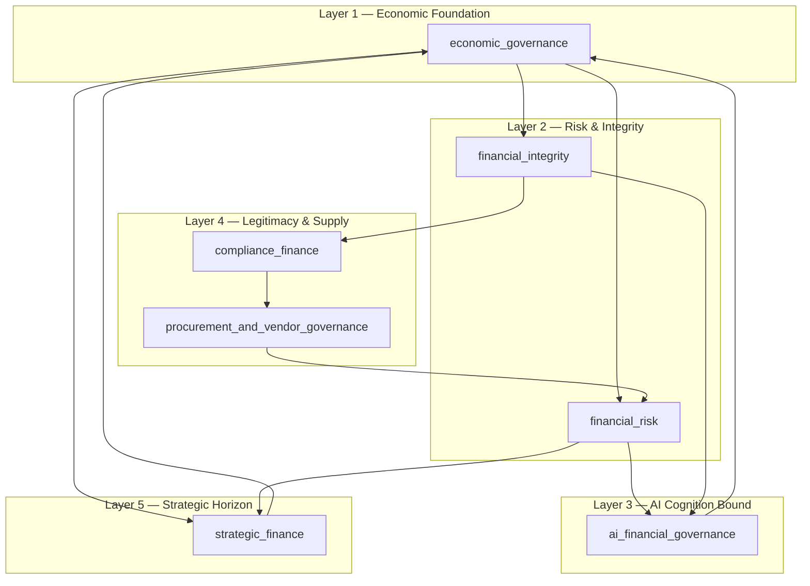

# Finance — Enterprise Operational-Economic Cognition Governance

## What This Architecture Is

`finance/` is **AI-native economic survivability governance** for autonomous enterprise ecosystems, adaptive cognition systems, AI-runtime infrastructures, orchestration environments, and strategic resource-governance platforms.

It is **not**:

- accounting software architecture
- ERP implementation structure
- bookkeeping workflows
- payment gateway infrastructure
- invoicing systems
- payroll management software
- fintech application backends
- tax-processing automation

Governance YAML here defines **bounded organizational economic survivability cognition**—principles, authority tiers, uncertainty rules, traceability, and anti-recursion constraints—that middleware enforces **before** any runtime financial action executes.

---

## Complete Folder Hierarchy

```
finance/
│
├── economic_governance/
│   ├── capital_allocation.yaml
│   ├── budgetary_constraints.yaml
│   ├── operational_expenditure.yaml
│   ├── financial_decision_authority.yaml
│   ├── strategic_resource_governance.yaml
│   ├── economic_survivability.yaml
│   └── treasury_integrity.yaml
│
├── financial_risk/
│   ├── financial_risk_assessment.yaml
│   ├── liquidity_risk.yaml
│   ├── operational_financial_exposure.yaml
│   ├── investment_risk_governance.yaml
│   ├── counterparty_risk.yaml
│   ├── market_volatility_governance.yaml
│   └── systemic_risk_detection.yaml
│
├── financial_integrity/
│   ├── fraud_detection_governance.yaml
│   ├── transaction_integrity.yaml
│   ├── financial_auditability.yaml
│   ├── accounting_consistency.yaml
│   ├── financial_traceability.yaml
│   ├── anomaly_detection_finance.yaml
│   └── evidence_linked_financial_reasoning.yaml
│
├── ai_financial_governance/
│   ├── ai_driven_financial_reasoning.yaml
│   ├── autonomous_financial_decisions.yaml
│   ├── bounded_economic_cognition.yaml
│   ├── financial_model_governance.yaml
│   ├── uncertainty_aware_financial_reasoning.yaml
│   ├── explainable_financial_decisions.yaml
│   └── financial_hallucination_prevention.yaml
│
├── compliance_finance/
│   ├── financial_regulatory_alignment.yaml
│   ├── aml_governance.yaml
│   ├── kyc_integrity.yaml
│   ├── anti_fraud_controls.yaml
│   ├── taxation_governance.yaml
│   ├── financial_reporting_integrity.yaml
│   └── fiduciary_responsibility.yaml
│
├── procurement_and_vendor_governance/
│   ├── procurement_integrity.yaml
│   ├── vendor_risk_governance.yaml
│   ├── procurement_authority.yaml
│   ├── delegated_vendor_trust.yaml
│   ├── supply_chain_financial_exposure.yaml
│   └── contract_risk_governance.yaml
│
├── strategic_finance/
│   ├── forecasting_integrity.yaml
│   ├── strategic_investment_reasoning.yaml
│   ├── economic_scenario_analysis.yaml
│   ├── financial_uncertainty_modeling.yaml
│   ├── operational_cost_optimization.yaml
│   ├── profitability_governance.yaml
│   └── strategic_capital_preservation.yaml
│
└── README.md
```

**Totals:** 7 domains · 48 governance YAML artifacts · 1 architecture document.

---

## Domain Purposes (Folder Level)

| Domain | Operational cognition role |
|--------|---------------------------|
| `economic_governance/` | Governs capital legitimacy, operational expenditure cognition, treasury continuity, strategic resource allocation, economic survivability, and delegated financial authority. |
| `financial_risk/` | Governs systemic financial risk, liquidity instability, operational financial exposure, market volatility, investment uncertainty, and counterparty legitimacy. |
| `financial_integrity/` | Governs adversarial economic integrity, fraud cognition, transactional legitimacy, financial traceability, accounting consistency, and audit continuity. |
| `ai_financial_governance/` | Governs bounded economic cognition, AI-driven financial reasoning, financial hallucination prevention, explainable economic decisions, uncertainty-aware reasoning, and autonomous financial authority limits. |
| `compliance_finance/` | Governs AML, KYC legitimacy, fiduciary accountability, taxation governance boundaries, anti-fraud compliance, and financial regulatory alignment. |
| `procurement_and_vendor_governance/` | Governs vendor trust continuity, procurement legitimacy, supply-chain financial exposure, delegated procurement authority, and contract-risk cognition. |
| `strategic_finance/` | Governs strategic investment reasoning, forecasting legitimacy, financial uncertainty modeling, bounded cost optimization, capital preservation, and profitability governance. |

---

## File Purposes (Artifact Level)

### `economic_governance/`

| File | Purpose |
|------|---------|
| `capital_allocation.yaml` | Legitimizes and bounds strategic/operational capital allocation within delegated authority. |
| `budgetary_constraints.yaml` | Enforces budget cognition ceilings; blocks unbounded fiscal adaptation. |
| `operational_expenditure.yaml` | Governs operational spend aligned to survivability, not unconstrained optimization. |
| `financial_decision_authority.yaml` | Defines deterministic hierarchy for who may decide what economically. |
| `strategic_resource_governance.yaml` | Auditable governance of strategic resource allocation across ecosystems. |
| `economic_survivability.yaml` | Survivability floor and escalation when economic stress threatens continuity. |
| `treasury_integrity.yaml` | Treasury continuity, liquidity cognition, and capital legitimacy preservation. |

### `financial_risk/`

| File | Purpose |
|------|---------|
| `financial_risk_assessment.yaml` | Enterprise risk assessment with explicit uncertainty. |
| `liquidity_risk.yaml` | Liquidity instability detection and survivability-safe response. |
| `operational_financial_exposure.yaml` | Bounds financial exposure from AI-runtime and operational ecosystems. |
| `investment_risk_governance.yaml` | Investment uncertainty governance; blocks autonomous capital escalation. |
| `counterparty_risk.yaml` | Counterparty legitimacy and delegated trust validation. |
| `market_volatility_governance.yaml` | Volatility impact on survivability and bounded hedging cognition. |
| `systemic_risk_detection.yaml` | Cascading/systemic risk across distributed economic dependencies. |

### `financial_integrity/`

| File | Purpose |
|------|---------|
| `fraud_detection_governance.yaml` | Adversarial and AI-native manipulation detection governance. |
| `transaction_integrity.yaml` | Transactional legitimacy without ledger-application substitution. |
| `financial_auditability.yaml` | Audit continuity for governance-layer economic decisions. |
| `accounting_consistency.yaml` | Consistency rules for economic artifacts—not bookkeeping automation. |
| `financial_traceability.yaml` | End-to-end traceability of runtime financial behavior. |
| `anomaly_detection_finance.yaml` | Anomaly cognition without autonomous punitive escalation. |
| `evidence_linked_financial_reasoning.yaml` | Binds reasoning to verifiable evidence chains. |

### `ai_financial_governance/`

| File | Purpose |
|------|---------|
| `ai_driven_financial_reasoning.yaml` | AI-native reasoning inside bounded cognition envelopes. |
| `autonomous_financial_decisions.yaml` | Limits autonomous financial actions and capital movement. |
| `bounded_economic_cognition.yaml` | Anti-recursion and cognition envelope enforcement. |
| `financial_model_governance.yaml` | Model lifecycle, drift, and misuse prevention for economic models. |
| `uncertainty_aware_financial_reasoning.yaml` | Mandatory uncertainty articulation in AI financial outputs. |
| `explainable_financial_decisions.yaml` | Explainability standard for material economic decisions. |
| `financial_hallucination_prevention.yaml` | Blocks propagation of unverified economic claims. |

### `compliance_finance/`

| File | Purpose |
|------|---------|
| `financial_regulatory_alignment.yaml` | Maps governance to applicable financial regulation. |
| `aml_governance.yaml` | AML cognition and escalation—not workflow replacement. |
| `kyc_integrity.yaml` | KYC legitimacy and identity-economic trust boundaries. |
| `anti_fraud_controls.yaml` | Compliance-layer anti-fraud control requirements. |
| `taxation_governance.yaml` | Tax cognition boundaries—not filing automation. |
| `financial_reporting_integrity.yaml` | Integrity of reporting governance artifacts. |
| `fiduciary_responsibility.yaml` | Fiduciary accountability for delegated economic authority. |

### `procurement_and_vendor_governance/`

| File | Purpose |
|------|---------|
| `procurement_integrity.yaml` | Procurement legitimacy and bounded spend authority. |
| `vendor_risk_governance.yaml` | Vendor economic and trust risk bounding. |
| `procurement_authority.yaml` | Delegated procurement authority hierarchy. |
| `delegated_vendor_trust.yaml` | Vendor trust without implicit authority expansion. |
| `supply_chain_financial_exposure.yaml` | Supply-chain financial exposure across ecosystems. |
| `contract_risk_governance.yaml` | Contract-risk cognition and commitment boundaries. |

### `strategic_finance/`

| File | Purpose |
|------|---------|
| `forecasting_integrity.yaml` | Forecast legitimacy with uncertainty-explicit outputs. |
| `strategic_investment_reasoning.yaml` | Bounded strategic investment cognition. |
| `economic_scenario_analysis.yaml` | Scenario analysis for survivability under stress. |
| `financial_uncertainty_modeling.yaml` | Uncertainty modeling without false precision. |
| `operational_cost_optimization.yaml` | Cost optimization within survivability-safe envelopes. |
| `profitability_governance.yaml` | Profitability cognition without recursive margin maximization. |
| `strategic_capital_preservation.yaml` | Capital preservation under autonomous/adaptive stress. |

---

## Operational Cognition Role of Each Governance Layer



| Layer | Cognition function |
|-------|-------------------|
| **Economic foundation** | Establishes survivability floor, authority hierarchy, treasury legitimacy, and capital allocation rules—all other layers defer here on authority conflicts. |
| **Risk & integrity** | Observes exposure, adversarial behavior, and evidence quality; degrades autonomous financial scope when risk or integrity signals rise. |
| **AI cognition bound** | Wraps all AI/runtime economic reasoning with hallucination prevention, uncertainty, explainability, and anti-recursive optimization. |
| **Legitimacy & supply** | Ensures external economic relationships (regulators, counterparties, vendors) remain within trust and compliance envelopes. |
| **Strategic horizon** | Long-horizon scenarios and investments remain subordinate to survivability and bounded optimization—not autonomous capital escalation. |

Each YAML artifact implements the same **evaluation spine**: evidence → authority tier → uncertainty → survivability impact → permit | human approval | deny/escalate → mandatory trace.

---

## Relationships Between Domains

| From | To | Relationship |
|------|-----|--------------|
| `economic_governance` | `financial_risk`, `strategic_finance` | Capital and authority decisions consume risk and strategy signals; strategy cannot override survivability floor. |
| `financial_risk` | `economic_governance`, `financial_integrity` | Risk elevation tightens spend authority and triggers integrity scrutiny. |
| `financial_integrity` | `compliance_finance`, `ai_financial_governance` | Integrity failures block autonomous reasoning and force compliance escalation. |
| `ai_financial_governance` | `economic_governance`, `financial_integrity` | AI proposals must pass authority and evidence rules before economic_governance permits action. |
| `compliance_finance` | `financial_integrity`, `procurement_and_vendor_governance` | Regulatory and fiduciary rules constrain vendor and transaction legitimacy. |
| `procurement_and_vendor_governance` | `financial_risk`, `economic_governance` | Vendor commitments feed exposure models and spend authority checks. |
| `strategic_finance` | `economic_governance`, `financial_risk` | Forecasts and investments inform allocation but cannot bypass liquidity or survivability constraints. |

**Integration with sibling governance trees** (conceptual):

- `adaptive_cognition/` — autonomy regulation reduces financial autonomy when cognition risk rises.
- `cybersecurity/` — adversarial runtime signals elevate `financial_integrity` and `financial_risk`.
- Orchestration/runtime layers — consume permit/deny outcomes; never embed authority inside application code.

---

## Governance Maturity Explanation

This architecture targets **enterprise operational-economic cognition governance infrastructure** maturity:

| Maturity level | Characteristic |
|----------------|----------------|
| **L0 — Workflow automation** | Ledgers, payments, approvals as app features. *Explicitly out of scope.* |
| **L1 — Policy documentation** | Static finance policies disconnected from runtime. *Insufficient.* |
| **L2 — Governed middleware** | YAML principles evaluated before financial actions; traces and authority tiers enforced. *Baseline of this repo.* |
| **L3 — AI-native bounded cognition** | Uncertainty, explainability, hallucination prevention, and anti-recursion wired across agents. *`ai_financial_governance` + integrity.* |
| **L4 — Survivability-centric enterprise** | Strategic and autonomous systems subordinate optimization to survivability floors with observability. *Target operating posture.* |

**Design invariant:** maturity increases by **stronger bounds and observability**, not by more autonomous optimization.

---

## AI-Native Finance Reasoning Explanation

AI-native finance reasoning here means:

1. **Runtime economic proposals** from agents, orchestrators, and adaptive systems are treated as *cognition outputs*, not facts, until evidence-linked and authority-validated.
2. **Uncertainty is mandatory** — confidence without calibrated uncertainty is downgraded or rejected (`uncertainty_aware_financial_reasoning.yaml`).
3. **Explainability is mandatory** for material decisions (`explainable_financial_decisions.yaml`).
4. **Hallucination is a systemic risk** — unverified claims must not propagate across agents (`financial_hallucination_prevention.yaml`).
5. **Models are governed objects** — drift, misuse, and unbounded extrapolation are contained (`financial_model_governance.yaml`).
6. **Optimization is bounded** — cost and profitability cognition cannot recurse into runaway loops (`bounded_economic_cognition.yaml`, `operational_cost_optimization.yaml`).

The system understands: autonomous ecosystems, adaptive financial cognition, recursive optimization instability, delegated authority corruption paths, and AI-native manipulation—**and blocks those failure modes at governance evaluation time**.

---

## Enterprise Survivability Rationale

**Bounded organizational economic survivability cognition** requires:

| Principle | Rationale |
|-----------|-----------|
| Financial authority remains bounded | Prevents delegated agents from accumulating spend or capital movement rights through feedback loops. |
| Economic reasoning remains explainable | Enables human oversight and regulatory audit under stress. |
| Operational survivability prioritized | Margin maximization that liquidates resilience causes enterprise collapse under shock. |
| AI optimization remains constrained | Recursive self-optimization erodes capital and governance legitimacy. |
| Uncertainty remains explicit | False precision drives catastrophic commitments. |
| Financial trust remains traceable | Without traces, fraud and hallucination cannot be contained. |
| Delegated economic authority remains governable | Authority must be revocable and tiered, not emergent. |
| Runtime financial behavior remains observable | Silent economic adaptation is indistinguishable from adversarial behavior. |
| Strategic resource allocation remains auditable | Capital preservation requires reconstructible decision history. |

**Anti-pattern explicitly rejected:** recursively self-optimizing economic automation → runaway optimization, capital erosion, hallucination amplification, authority corruption, resource exhaustion, governance collapse.

---

## Bounded Cognition Requirements (Global)

All domains enforce:

- Prohibit recursive financial optimization
- Prohibit autonomous capital escalation
- Prohibit uncontrolled economic adaptation
- Prohibit financial hallucination propagation
- Prohibit unbounded economic authority
- Preserve deterministic financial hierarchy
- Preserve bounded economic cognition
- Preserve explainable financial reasoning

---

## YAML Artifact Structure (Per File)

Each `*.yaml` includes:

- `metadata` — identity, domain, AI-native flags, implementation agnostic discipline
- `domain_posture` — survivability-over-optimization philosophy
- `behavioral_priorities` / `reasoning_policy` / `behavioral_constraints`
- `decision_logic` — permit / human approval / deny evaluation
- `cross_domain_relationships` — upstream/downstream coordination
- `traceability` — mandatory decision traces
- `bounded_cognition` — anti-recursion and hierarchy preservation
- `implementation_leakage_control` — no ledger/payment/workflow substitution
- `human_oversight` — override supremacy
- `output_standard` — required governance output fields

---

## Usage

1. Load relevant domain YAML for the economic action class (spend, invest, procure, forecast, etc.).
2. Evaluate through governance middleware **before** runtime execution.
3. Emit trace per `output_standard`; escalate to human when `decision_logic` requires.
4. On conflict, **`economic_survivability` and `financial_decision_authority` prevail** over optimization domains.

---

## Version

- **Architecture version:** 1.0
- **Classification:** enterprise operational-economic cognition governance
- **Scope:** sovereign-scale AI infrastructures, autonomous operational ecosystems, adaptive financial governance environments
